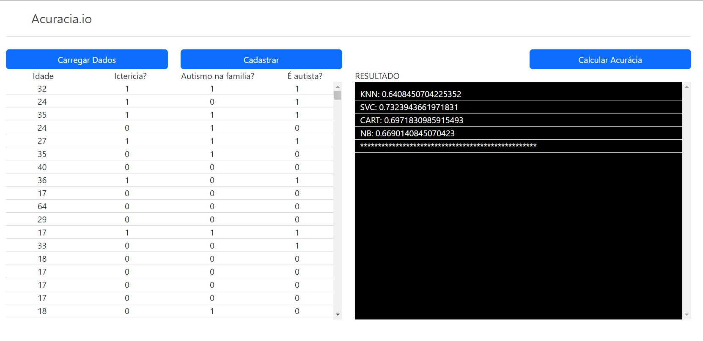

<p align="center" style="margin: 40px 0">
    Acuracia.io
</p>

<div align="center">


</div>

# Acuracia.io - Front-end

Cálculo de acuracia.

Software foi desenvolvido para o MVP da pós graduação de Engenharia de Software PUC-Rio, Disciplina: Sprint: Qualidade de Software, Segurança e Sistemas Inteligentes (40530010063_20240_01)
Apresentação em: ...

> ⚠️ Para o funcionamento dessa aplicação, é necessária a execução da API. Você pode acessar o repositório da API [clicando aqui](https://github.com/elianoestevampuc/acuracia.io-backend.git).

## Pré-visualização

<p align="center" style="margin: 40px 0">
    
</p>

## Executando a Aplicação


### 1 - Clonando o repositório
Para clonar o projeto execute seguinte comando:

```
git clone https://github.com/elianoestevampuc/acuracia.io-frontend.git
```

### 2 - Executando a Aplicação
Para executar o front-end, execute a API e basta abrir o arquivo index.html no seu browser.

